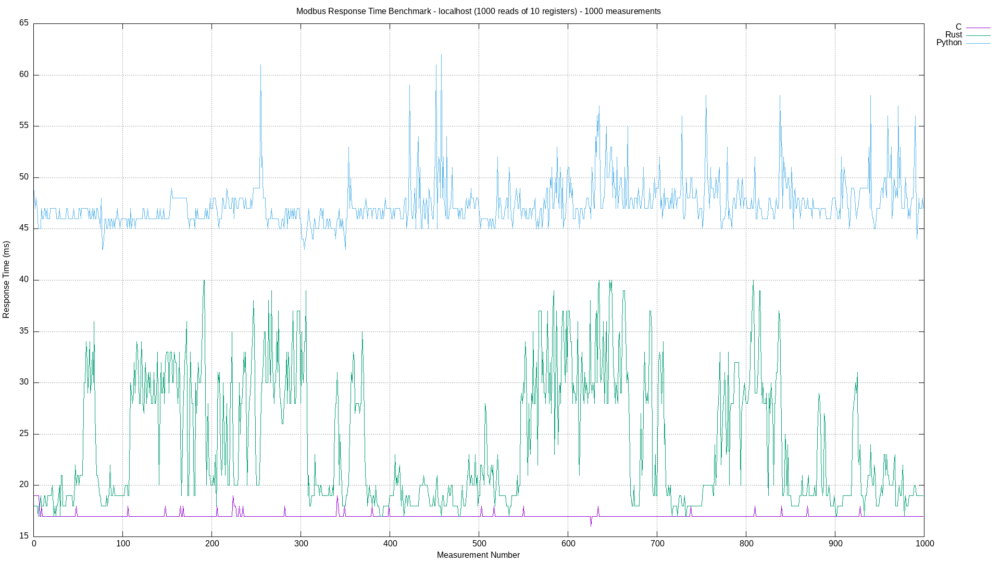
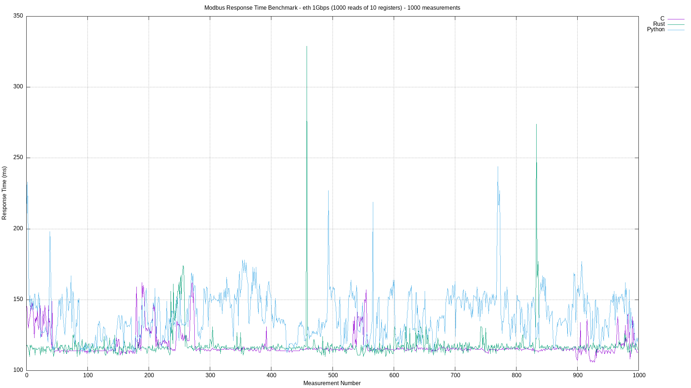

# Modbus TCP Performance Benchmark

## Overview
This repository contains a comprehensive benchmark suite for evaluating the performance of Modbus TCP across different programming environments. It includes a Modbus TCP server implemented in C and clients in Python, C, and Rust. The aim is to provide a comparative analysis of how Modbus TCP performs in these diverse environments, offering insights into speed, efficiency, and scalability.

## Components
Modbus TCP Server (C): A robust and efficient server built in C, utilizing libmodbus for handling Modbus requests. It is designed to handle multiple connections and requests efficiently.

## Modbus Clients:

- Python Client: Implements Modbus TCP client using the pymodbus library. Ideal for testing against a high-level, dynamically-typed language environment.
- C Client: A low-level client written in C, providing a direct comparison with the server's environment.
- Rust Client: Offers a look at Modbus TCP performance in a modern, systems-level language known for its safety and performance.

## Purpose
The primary goal of this project is to benchmark and compare the performance of Modbus TCP implementations in different programming languages and environments. By analyzing various aspects such as response time, data throughput, and CPU/memory usage, we aim to provide valuable data for developers and engineers who work with industrial communication protocols and are considering Modbus TCP for their applications.

## Usage
Each component in this repository has its own set of instructions for compilation and execution. Refer to the respective directories for detailed guidelines.

- For the Modbus TCP Server (C), navigate to the `c-server` directory.
- For client implementations, visit `clients` and choose the respective language directory.

## Benchmarks
The benchmarks focus on key performance metric:

- **Response Time:** Measures the time required for read 10 registers from remote MODBUS TCP server.

## Sample results

## Contributing
Contributions to this benchmark suite are welcome. Whether it's adding new features, improving existing code, or reporting issues, your input is valuable.

## License
This project is licensed under MIT License. Feel free to use, modify, and distribute the code as per the license terms.
